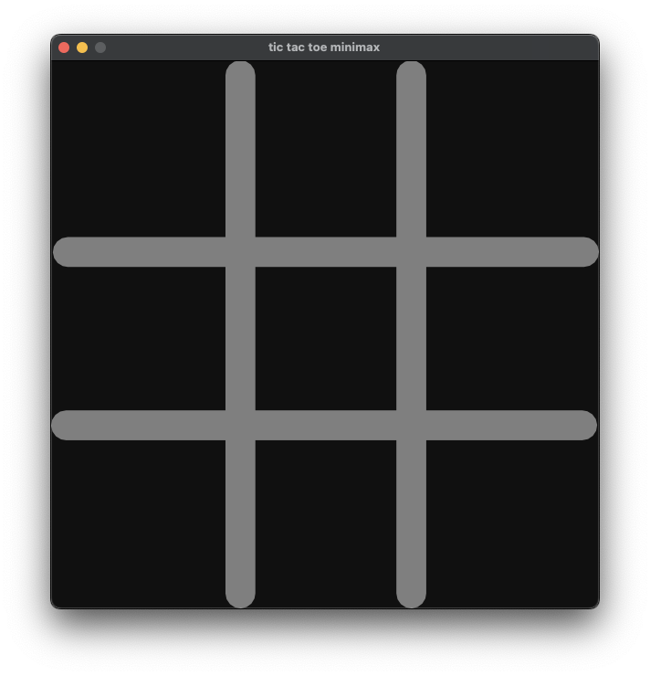
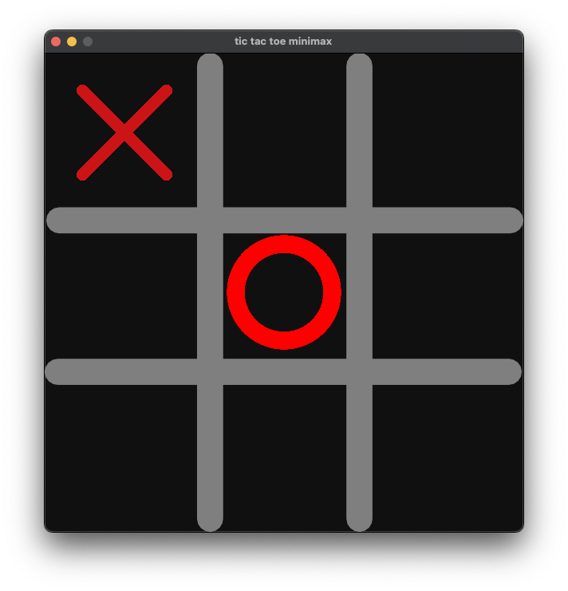
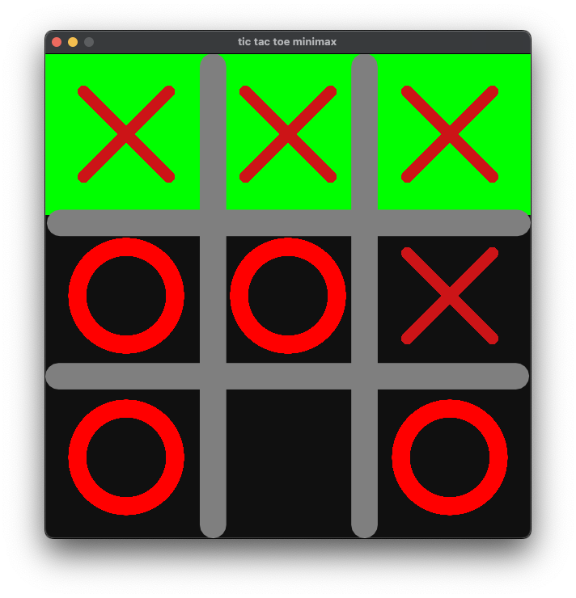

# Tic-Tac-Toe with SFML and Minimax Algorithm

This is a simple implementation of the classic Tic-Tac-Toe game written in C++17, utilizing the SFML library for the graphical user interface and implementing the Minimax algorithm for the computer opponent.

## Features

- Graphical User Interface (GUI) built using SFML.
- Single-player mode against computer using the Minimax algorithm.
- Win detection algorithm to determine game outcomes.
- Press r to rerun the game.

## Screenshots





## Prerequisites

- CMake
- C++17 compiler
- SFML library

## How to Build and Run

1. Clone this repository to your local machine:
    ```bash
    git clone https://github.com/whoami13579/tic_tac_toe_minimax.git
    ```
2. Navigate to the project directory:
    ```bash
    cd tic_tac_toe_minimax
    ```
3. Create a build directory and navigate into it:
    ```bash
    mkdir build && cd build
    ```
4. Generate build files using CMake:
    ```bash
    cmake ..
    ```
5. Build the project using your preferred build system (e.g., make):
    ```bash
    make
    ```
6. Run the compiled executable:
    ```bash
    ./tic_tac_toe_minimax
    ```

## How to Play

- When the game starts, you will be presented with a menu where you can choose to play against the AI.
- Click on a cell in the grid to make your move.
- The game will automatically detect when a player wins or if the game ends in a draw.
